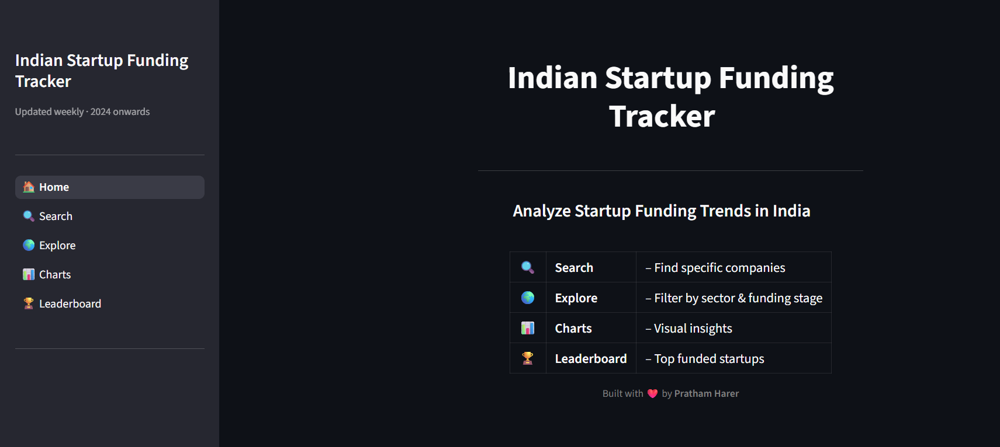
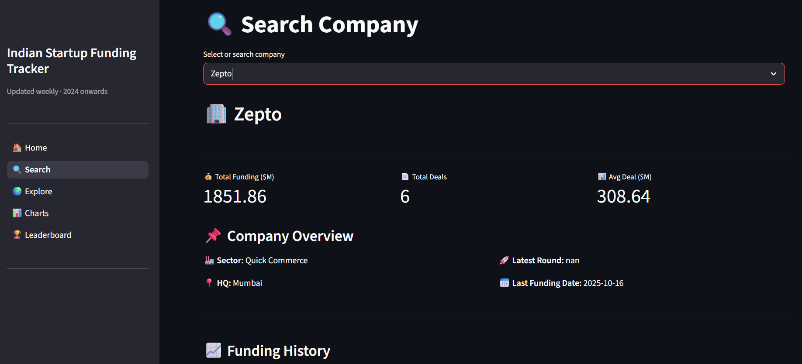
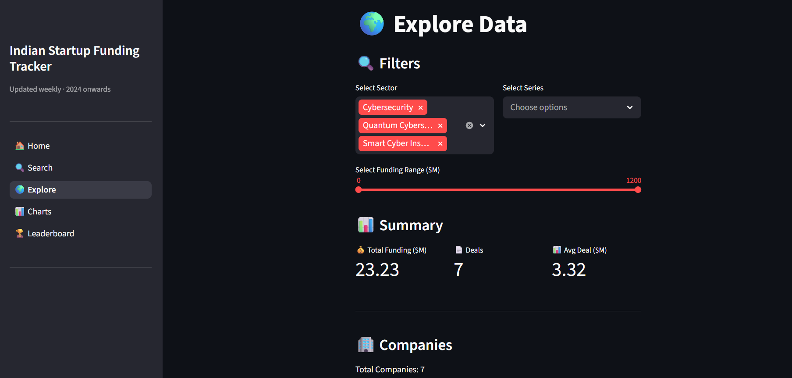
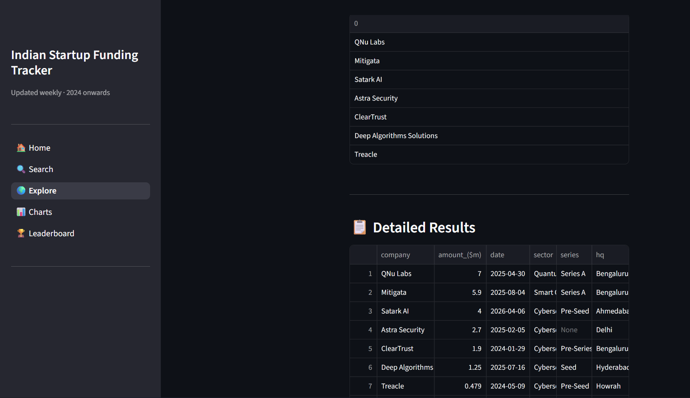
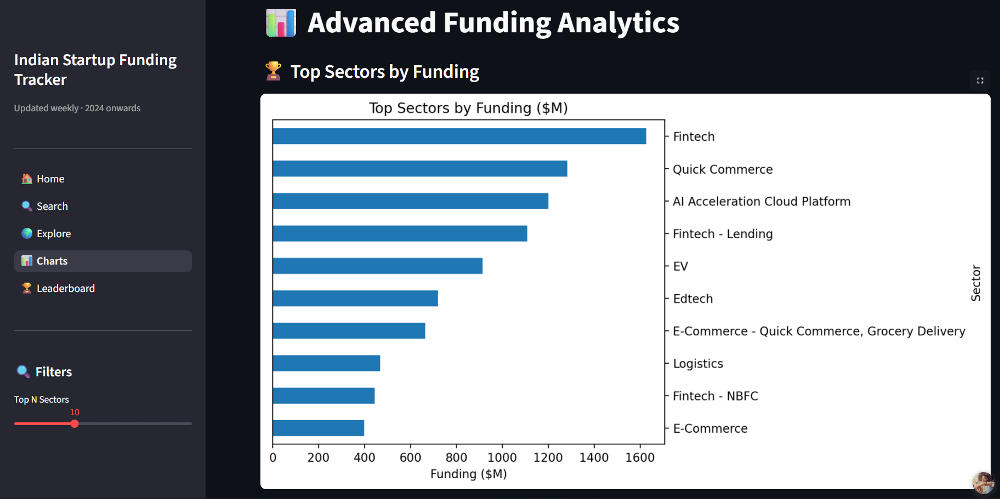
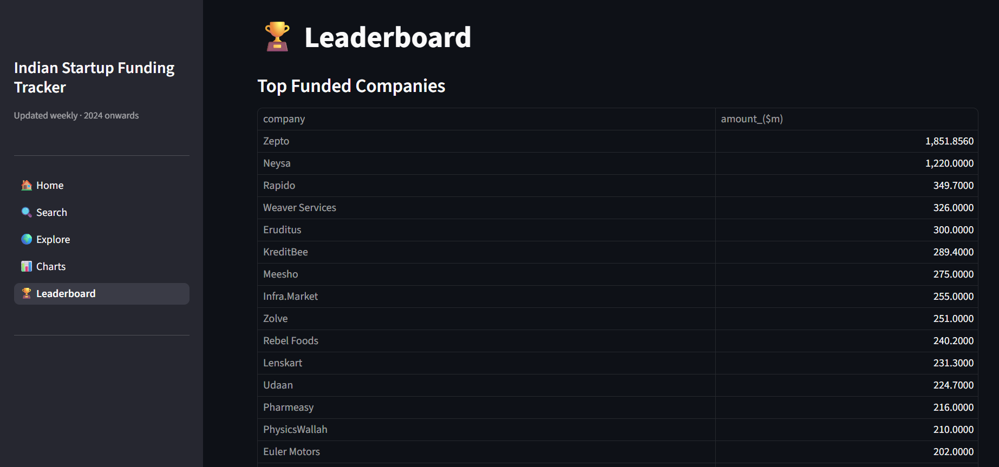

<p align="center">
  
</p>

---

<h3 align="center">A Weekly-Updated Dashboard for Indian Startup Funding Rounds (2024 Onwards)</h3>

---

## 📌 Project Overview

Indian Startup Funding Tracker is a data dashboard built to surface funding activity across the Indian startup ecosystem — updated weekly.

The objective of this project is to provide a clean, searchable, and filterable interface for exploring Indian startup funding rounds from 2024 onwards — with visual analytics, leaderboards, and CSV export — all powered by a lightweight Streamlit frontend.

The complete workflow covers fuzzy company search, sector and series filtering, trend charts, and a top-funded leaderboard with source news links.

---

## 📈 Application Preview

### Dashboard Interface



### Search



### Explore




### Charts



### Leaderboard



---

## 🎯 Problem Statement

Tracking Indian startup funding requires manually sifting through news articles, databases, and newsletters with no unified interface.

The challenge was to:

* Aggregate public funding round data into a structured, queryable format
* Enable fuzzy search and multi-dimensional filtering (sector, series, amount, date)
* Visualize sector-wise funding distribution and weekly trends
* Build a leaderboard of the most-funded startups with source attribution
* Allow users to export filtered data for their own analysis

This project focuses on making startup funding data accessible and explorable through a clean, interactive interface.

---

## 📊 Dataset

* Format: `.csv` (exported from Notion, updated weekly)
* Type: Structured tabular data
* Source: Manually curated from public news articles
* Coverage: Indian startups, January 2024 onwards

**Schema:**

| Column | Description |
|---|---|
| `company_name` | Name of the startup |
| `amount_usd` | Funding amount in USD (millions) |
| `series` | Funding stage (Seed, Pre-A, A, B, C, etc.) |
| `sector` | Industry sector |
| `headquarters` | City / State |
| `date` | Date of funding announcement |
| `source_url` | News article link |

---

## ⚙️ Tools & Technologies Used

* **Python** – Core programming language
* **Streamlit** – Interactive multi-page web application
* **Pandas** – Data manipulation and filtering
* **Plotly** – Interactive charts and visualizations
* **RapidFuzz** – Fuzzy company name search
* **Notion API** *(optional)* – Live data sync

---

## 🧱 Workflow Architecture

```
Weekly News Curation
→ Notion Table Update (company, amount, series, sector, date, source)
→ CSV Export → data/funding_data.csv
→ Data Loading & Preprocessing (utils/data_loader.py)
→ Search / Filter / Chart / Leaderboard (Streamlit pages)
→ CSV Export for end users
```

---

## 📊 Features Implemented

* **Search** — Fuzzy search by company name with detail cards
* **Explore** — Filter by sector, series, amount range, date; sortable table
* **Charts** — Sector-wise funding, weekly trends, series distribution
* **Leaderboard** — Top funded companies with news source links
* **Export** — Download filtered results as CSV

---

## 📂 Project Structure

```
indian-startup-funding-tracker/
│
├── app.py                  → Main Streamlit entry point
│
├── data/
│   └── funding_data.csv    → Exported Notion table (updated weekly)
│
├── pages/
│   ├── 1_Search.py         → Company search & detail card
│   ├── 2_Explore.py        → Filter + sortable table
│   ├── 3_Charts.py         → Visual analytics
│   └── 4_Leaderboard.py    → Top funded companies
│
├── utils/
│   └── data_loader.py      → Cached data loading & preprocessing
│
├── requirements.txt        → Dependencies
└── images/                 → Screenshots and preview assets
```

---

## ▶ How to Run the Application

1. Clone the repository:

```
git clone https://github.com/YOUR_USERNAME/indian-startup-funding-tracker.git
```

2. Install dependencies:

```
pip install -r requirements.txt
```

3. Add your data — export your Notion table as CSV and save to:

```
data/funding_data.csv
```

4. Run the Streamlit app:

```
streamlit run app.py
```

---

## 📦 Requirements

```
streamlit
pandas
plotly
rapidfuzz
```

Install all at once:

```
pip install -r requirements.txt
```

---

## 💡 Key Learning Outcomes

* Building multi-page Streamlit applications with modular page structure
* Implementing fuzzy search with RapidFuzz for approximate company name matching
* Designing filter + sort interfaces for tabular data exploration
* Creating interactive Plotly charts for sector and trend analysis
* Structuring a weekly data pipeline from Notion → CSV → Dashboard

---

## 🔗 Important Links

### 🚀 Live Streamlit Application

Access the deployed app here:
[Click Here to access](https://indian-startup-funding-tracker.streamlit.app/)

### 📖 Medium Blog (Detailed Project Explanation)

Read the full case study here:
[Click Here to read](https://medium.com/@prathamharer1603/i-was-just-watching-youtube-then-i-accidentally-built-a-startup-funding-tracker-f0f0a7ebae79)

### 📊 Project Presentation (PPT Slides)

View the presentation slides here:
[Add Presentation Link Here]

### 🎥 YouTube Walkthrough (Application Demo & Explanation)

Watch the full project demo here:
[Add YouTube Demo Link Here]

---

## 📅 Data Updates

Data is sourced from public news and updated weekly. Original tracking started January 2024.
Last updated - 10/04/2026

---

## 🙌 Contributing

PRs welcome! If you find a missing funding round, feel free to open an issue.

---

<p align="center">Made with ❤️ by <b>PRATHAM HARER</b> • Indian Startup Funding Tracker</p>
